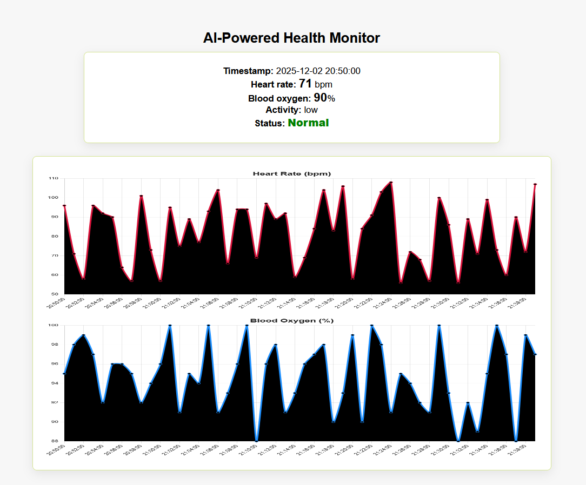

<!--
Place an image at `assets/screenshot.png` and a demo video at `assets/demo.mp4`.
You can replace or update these files with your own screenshots / recordings.
-->



# AI-Powered Health Monitoring System

Professional, minimal prototype demonstrating real-time wearable health monitoring, anomaly detection, and a user-facing dashboard.

Overview
--------
- Real-time health monitoring (simulated data)
- Anomaly detection using IsolationForest (unsupervised) with a rule-based fallback
- Live web dashboard showing metrics and time-series charts
- Simple training script and Dockerfile for quick deployment

Preview
-------
- Screenshot: the top of this document shows a placeholder image. Replace `assets/screenshot.png` with a screenshot of your running app.
- Demo video: see the embedded demo below (replace `assets/demo.mp4` with your recorded demo).

<video src="assets//videos/Medical_App.mp4" controls style="max-width:100%; height:auto; display:block; margin: 1rem 0;">
	Your browser does not support the video tag. Alternatively link to the file: `assets/demo.mp4`.
</video>

Quickstart (developer)
----------------------
These steps assume you have Python 3.9+ and Docker (optional) installed.

1. Create and activate a virtual environment, install dependencies:

```powershell
python -m venv .venv
.\.venv\Scripts\Activate.ps1
pip install -r requirements.txt
```

2. (Optional) Train the example anomaly detector and generate `model.joblib`:

```powershell
python -m src.models.train
```

3. Run the Flask web app locally:

```powershell
python -m src.app.app
```

4. Open the dashboard at: `http://127.0.0.1:5000`

Docker (quick demo)
-------------------
Build and run a container for quick sharing or demoing (development image):

```powershell
docker build -t health-monitor .
docker run -p 5000:5000 health-monitor
```

API endpoints (selected)
------------------------
- `GET /api/metrics` — returns a single simulated data point with anomaly label.
- `GET /api/history` — returns a small time-series (used by Chart.js in the dashboard).

Project layout
--------------
- `src/data/simulate.py` — data simulation utilities
- `src/models/anomaly.py` — IsolationForest wrapper and save/load helpers
- `src/models/train.py` — trains model on simulated data and saves `model.joblib`
- `src/app/app.py` — Flask app and API endpoints
- `src/app/templates/index.html` — simple dashboard UI
- `src/app/static/js/dashboard.js` — Chart.js dashboard logic
- `Dockerfile`, `requirements.txt`, `.gitignore`, `tests/`

Adding your screenshot and demo video
------------------------------------
1. Create an `assets/` folder at the project root.
2. Put a screenshot named `screenshot.png` there (recommended size: 1280×720). Example path: `assets/screenshot.png`.
3. Put a short demonstration video named `demo.mp4` in `assets/` (10–60 seconds). Example path: `assets/demo.mp4`.

Notes on media
--------------
- For quick screen capture on Windows, use the built-in Xbox Game Bar (Win+G) or a tool like OBS Studio.
- Compress the MP4 if large (HandBrake is useful) so Git pushes remain small. Consider storing large media outside the repo and linking to it if needed.

Testing
-------
Run the unit tests with `pytest`:

```powershell
pytest -q
```

Security & privacy
------------------
This project uses simulated data for demos. If you plan to connect real wearable data:
- Implement strong authentication and authorization.
- Store personal data encrypted at rest.
- Follow GDPR/HIPAA requirements applicable to your deployment and jurisdiction.

Contributing
------------
Pull requests are welcome. For significant changes, open an issue first to discuss the change.

License
-------
This project is provided for educational and prototyping purposes. No license is specified—please add one if you intend to publish or share widely.
